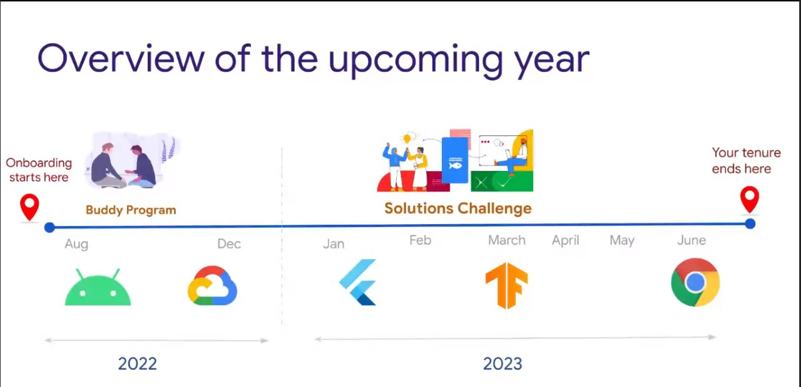

# GDSC AASC (Alpha Arts and Science College)
</h1>

 
<!-- Custom Image.. Beware the width --> 

# HELLO,Guy's 👋
## What is  GDSC ?  
Google Developer Student Clubs (GDSC) are community groups for college and university students interested in Google developer technologies. Students from all undergraduate or graduate programs with an interest in growing as a developer are welcome. By joining a GDSC, students grow their knowledge in a peer-to-peer learning environment and build solutions for local businesses and their community.GDSC helps students to learn technologies, connect with like minded people and build solutions for the community.
 
 

## What does the year ahead look like? 
There will be various campaigns and initiatives that you can expect and look forward to in your one year. Some of them are listed below with tentative timelines

 
  
 

## Wanna join with us?

click here ->  &nbsp;<a href="https://gdsc.community.dev/alpha-arts-and-science-college-chennai/" target="_blank">
        

<h2 align="center">📫 Contact us</h2>
 

     &nbsp;&nbsp;
     &nbsp;&nbsp;
     &nbsp;&nbsp;
     &nbsp;&nbsp;
        

